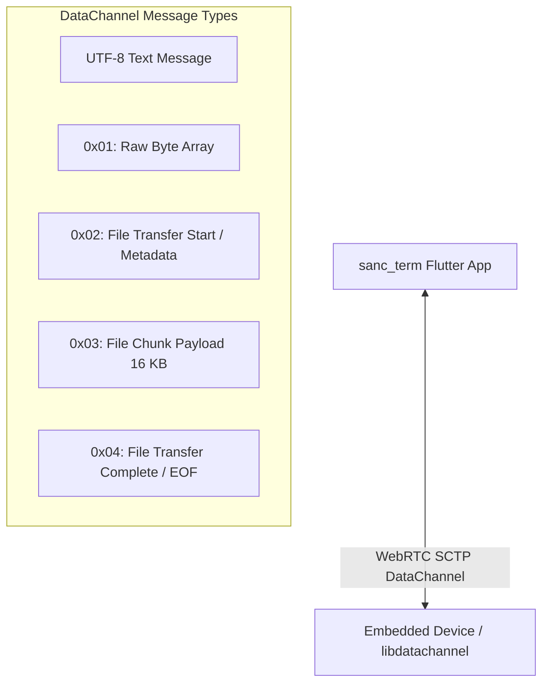

# WebRTC DataChannel Specification & Implementation Guide

## 1. Overview & Architecture

This document specifies the WebRTC SCTP DataChannel communication architecture implemented in `sanc_term` ([`cm_webrtc.dart`](file:///D:/GIT/GitHub/sanc_term/lib/features/panels/common/cm_webrtc.dart)).

The system provides bidirectional exchange of:

1. **UTF-8 Text Strings**: Control commands, interactive terminal I/O, telemetry strings.
2. **Raw Byte Arrays**: Sensor payloads, hex commands, hardware register packets.
3. **Binary File Transfers**: Direct delivery for small files and chunked multi-phase streaming (`0x01`–`0x04`) for large files (firmware images, logs, captures).
4. **Periodic Packet Statistics**: 1-minute periodic debug logging of WebRTC audio and video RTP packets and throughput.



---

## 2. Framing & Envelope Protocol (0x01 - 0x04)

Because WebRTC DataChannels transmit generic binary frames (`rtc::binary`), an application-layer envelope distinguishes raw sensor byte arrays from multi-chunk large file transfers.

### Protocol Summary Table

| Byte 0 (Command ID) | Purpose | Frame Structure | Description |
| :--- | :--- | :--- | :--- |
| *Text (isBinary=false)* | **Text Message** | Plain UTF-8 string | String commands and logs |
| `0x01` | **Raw Byte Array** | `[0x01]` + `[Data Bytes]` | Single raw byte array / sensor reading |
| `0x02` | **File Start (Metadata)** | `[0x02]` + `NameLen(1B)` + `Filename(NB)` + `FileSize(4B)` + `TotalChunks(2B)` | Initializes file receiver on remote device |
| `0x03` | **File Chunk Payload** | `[0x03]` + `ChunkIndex(2B)` + `ChunkLen(2B)` + `ChunkData(NB)` | Transmits sliced data (default 16 KB slices) |
| `0x04` | **File Complete (EOF)** | `[0x04]` + `TotalChunksSent(2B)` + `TotalBytesSent(4B)` | Finalizes and closes the received file |

---

## 3. Frame Layout Details

### 3.1 Raw Byte Array (`0x01`)

Used for sending raw sensor readings, hardware commands, and hex patterns.

```text
+----------+-------------------------------------------------------+
|  Byte 0  |                     Bytes 1 .. N                      |
+----------+-------------------------------------------------------+
|   0x01   |                   Raw Payload Data                    |
+----------+-------------------------------------------------------+
```

- **Byte 0**: `0x01` (`kMsgTypeRawByteArray`)
- **Bytes 1..N**: Raw payload bytes (e.g. `AA BB CC DD EE FF 00 11`).

### 3.2 File Transfer Start / Metadata (`0x02`)

Sent as the first packet when initiating a multi-chunk large file transfer.

```text
+--------+----------+--------------------+---------------------+----------------------+
| Byte 0 |  Byte 1  | Bytes 2 .. (2+N-1) | Bytes (2+N)..(2+N+3)| Bytes (2+N+4)..(2+N+5)|
+--------+----------+--------------------+---------------------+----------------------+
|  0x02  | NameLen  |  Filename (UTF-8)  | Total Size (Uint32) | Total Chunks (Uint16)|
+--------+----------+--------------------+---------------------+----------------------+
```

- **Byte 0**: `0x02` (`kMsgTypeFileStart`)
- **Byte 1**: Length of filename in bytes ($1 \le N \le 255$).
- **Bytes 2..(2+N-1)**: UTF-8 encoded filename string (e.g. `"firmware.bin"`).
- **Bytes (2+N)..(2+N+3)**: Total file size in bytes (32-bit unsigned integer, Big-Endian).
- **Bytes (2+N+4)..(2+N+5)**: Total chunk count (16-bit unsigned integer, Big-Endian).

### 3.3 File Chunk Payload (`0x03`)

Streams sequential data slices (default 16,384 bytes per chunk) with pacing.

```text
+----------+----------------------+----------------------+-------------------------+
|  Byte 0  |     Bytes 1 .. 2     |     Bytes 3 .. 4     |      Bytes 5 .. N       |
+----------+----------------------+----------------------+-------------------------+
|   0x03   | Chunk Index (Uint16) | Chunk Length (Uint16)|    Chunk Binary Data    |
+----------+----------------------+----------------------+-------------------------+
```

- **Byte 0**: `0x03` (`kMsgTypeFileChunk`)
- **Bytes 1..2**: Zero-indexed chunk number ($0 \le \text{index} < \text{totalChunks}$, Big-Endian).
- **Bytes 3..4**: Length of data payload in this chunk (Big-Endian).
- **Bytes 5..N**: File slice binary data.

### 3.4 File Transfer Complete (`0x04`)

Sent after all chunks are transmitted to ensure receiver sync and file closure.

```text
+----------+-------------------------------+------------------------------+
|  Byte 0  |         Bytes 1 .. 2          |         Bytes 3 .. 6         |
+----------+-------------------------------+------------------------------+
|   0x04   | Total Chunks Sent (Uint16)    | Total Bytes Sent (Uint32)    |
+----------+-------------------------------+------------------------------+
```

- **Byte 0**: `0x04` (`kMsgTypeFileEnd`)
- **Bytes 1..2**: Verification count of total chunks sent (Big-Endian).
- **Bytes 3..6**: Verification count of total bytes sent (Big-Endian).

---

## 4. Transmission Modes & Controls

The WebRTC panel supports multiple delivery modes tailored for embedded devices:

1. **Send `[0x02 + Filename + Data]` (Single Payload)**:
   - For small/medium files ($\le 512\text{ KB}$).
   - Transmits `0x02` header + filename + entire file body in one message.
2. **Send Multi-Phase (`0x02` Start / `0x03` Chunks / `0x04` End)**:
   - Recommended for large files (multiple megabytes).
   - Slices the file into 16 KB chunks with 10ms pacing delay between chunks to prevent SCTP buffer congestion.
3. **Send Chunked (`0x02` Header Chunks)**:
   - Slices large files where every slice is prefixed with `0x02` for devices without `0x03`/`0x04` support.
4. **Send Raw Binary File (No Header)**:
   - Transmits pure file bytes without any protocol envelope prefix.

---

## 5. Resilient Auto-Recovery (`_reopenDataChannel`)

If the remote embedded device closes the DataChannel upon file completion, or if an SCTP buffer timeout occurs:

- **Automatic Reopening**: Any call to `_sendByteArray`, `_sendFile`, or `_sendDataMessage` detects closed state and automatically re-creates the channel on the active `PeerConnection`.
- **UI Status Badge & Button**: Card 4 displays live status (`DataChannel: open` / `DataChannel: closed`) and provides a manual **Reopen Channel** button.

---

## 6. Embedded C++ Reference Implementation (`libdatachannel`)

Below is the complete C++ receiver implementation for embedded devices handling `0x01` through `0x04`:

```cpp
#include <iostream>
#include <fstream>
#include <vector>
#include <string>
#include <cstdint>
#include <cstring>
#include <arpa/inet.h>
#include "rtc/rtc.hpp"

struct FileTransferState {
    bool isReceiving = false;
    std::string filename;
    uint32_t totalBytes = 0;
    uint16_t totalChunks = 0;
    uint32_t receivedBytes = 0;
    uint16_t receivedChunks = 0;
    std::ofstream fileStream;
};

FileTransferState g_fileState;

void handleDataChannelMessage(const rtc::binary& bytes, std::shared_ptr<rtc::DataChannel> dc) {
    if (bytes.empty()) return;

    uint8_t type = bytes[0];

    switch (type) {
        case 0x01: { // Raw Byte Array / Sensor Data
            size_t payloadLen = bytes.size() - 1;
            const uint8_t* payload = bytes.data() + 1;
            std::cout << "[WebRTC 0x01] Received Raw Byte Array (" << payloadLen << " bytes): ";
            for (size_t i = 0; i < std::min(payloadLen, size_t(16)); ++i) {
                printf("%02X ", payload[i]);
            }
            std::cout << std::endl;
            break;
        }

        case 0x02: { // File Start or Single-Message File
            if (bytes.size() < 2) return;
            uint8_t nameLen = bytes[1];
            if (bytes.size() < 2 + nameLen) return;

            std::string filename(reinterpret_cast<const char*>(bytes.data() + 2), nameLen);

            // Check if this is a Multi-Phase Start Packet (contains size + chunk count)
            if (bytes.size() == 2 + nameLen + 6) {
                uint32_t totalSize = ntohl(*reinterpret_cast<const uint32_t*>(bytes.data() + 2 + nameLen));
                uint16_t totalChunks = ntohs(*reinterpret_cast<const uint16_t*>(bytes.data() + 2 + nameLen + 4));

                g_fileState.isReceiving = true;
                g_fileState.filename = filename;
                g_fileState.totalBytes = totalSize;
                g_fileState.totalChunks = totalChunks;
                g_fileState.receivedBytes = 0;
                g_fileState.receivedChunks = 0;

                g_fileState.fileStream.open("/tmp/" + filename, std::ios::binary | std::ios::trunc);
                std::cout << "[WebRTC 0x02] File Start: " << filename 
                          << " (" << totalSize << " bytes, " << totalChunks << " chunks)" << std::endl;
            } else {
                // Single-Message Direct File Payload [0x02, nameLen, name, data...]
                size_t fileDataOffset = 2 + nameLen;
                size_t fileDataLen = bytes.size() - fileDataOffset;

                std::ofstream out("/tmp/" + filename, std::ios::binary | std::ios::trunc);
                if (out.is_open()) {
                    out.write(reinterpret_cast<const char*>(bytes.data() + fileDataOffset), fileDataLen);
                    out.close();
                    std::cout << "[WebRTC 0x02] Single-Message File Saved: /tmp/" 
                              << filename << " (" << fileDataLen << " bytes)" << std::endl;
                }
            }
            break;
        }

        case 0x03: { // File Chunk Payload
            if (!g_fileState.isReceiving || !g_fileState.fileStream.is_open()) {
                std::cerr << "[WebRTC 0x03 Error] Received chunk without active File Start." << std::endl;
                return;
            }
            if (bytes.size() < 5) return;

            uint16_t chunkIndex = ntohs(*reinterpret_cast<const uint16_t*>(bytes.data() + 1));
            uint16_t chunkLen = ntohs(*reinterpret_cast<const uint16_t*>(bytes.data() + 3));
            const char* chunkData = reinterpret_cast<const char*>(bytes.data() + 5);

            g_fileState.fileStream.write(chunkData, chunkLen);
            g_fileState.receivedBytes += chunkLen;
            g_fileState.receivedChunks++;

            std::cout << "[WebRTC 0x03] Received Chunk #" << (chunkIndex + 1) 
                      << " (" << chunkLen << " bytes, total: " 
                      << g_fileState.receivedBytes << "/" << g_fileState.totalBytes << ")" << std::endl;
            break;
        }

        case 0x04: { // File Transfer Complete / EOF
            if (g_fileState.isReceiving && g_fileState.fileStream.is_open()) {
                uint16_t totalChunksSent = ntohs(*reinterpret_cast<const uint16_t*>(bytes.data() + 1));
                uint32_t totalBytesSent = ntohl(*reinterpret_cast<const uint32_t*>(bytes.data() + 3));

                g_fileState.fileStream.flush();
                g_fileState.fileStream.close();
                g_fileState.isReceiving = false;

                std::cout << "[WebRTC 0x04] File Transfer Complete: /tmp/" 
                          << g_fileState.filename << " (" << g_fileState.receivedBytes 
                          << " bytes written across " << g_fileState.receivedChunks << " chunks)." << std::endl;
            }
            break;
        }

        default:
            std::cout << "[WebRTC] Unknown binary message type: 0x" 
                      << std::hex << int(type) << " (" << std::dec << bytes.size() << " bytes)" << std::endl;
            break;
    }
}
```

---

## 7. 1-Minute Periodic Packet Stats Logging

The panel runs a periodic 60-second timer querying `_peerConnection.getStats()`:

- Extracts `inbound-rtp` and `ssrc` reports for audio and video media.
- Calculates 1-minute deltas:
  - Total packets received and delta ($\Delta\text{pkts}/\text{min}$).
  - Total payload bytes received and throughput bitrate ($\text{kbps}$).
  - Total packets lost.
- Outputs structured debug prints:
  ```text
  [WebRTC 1-Min Stats] Audio: +3000 pkts (50.0 pkt/s, 192.0 KB, 25.6 kbps, Lost: 0) | Video: +1800 pkts (30.0 pkt/s, 4.50 MB, 600.0 kbps, Lost: 0)
  ```
