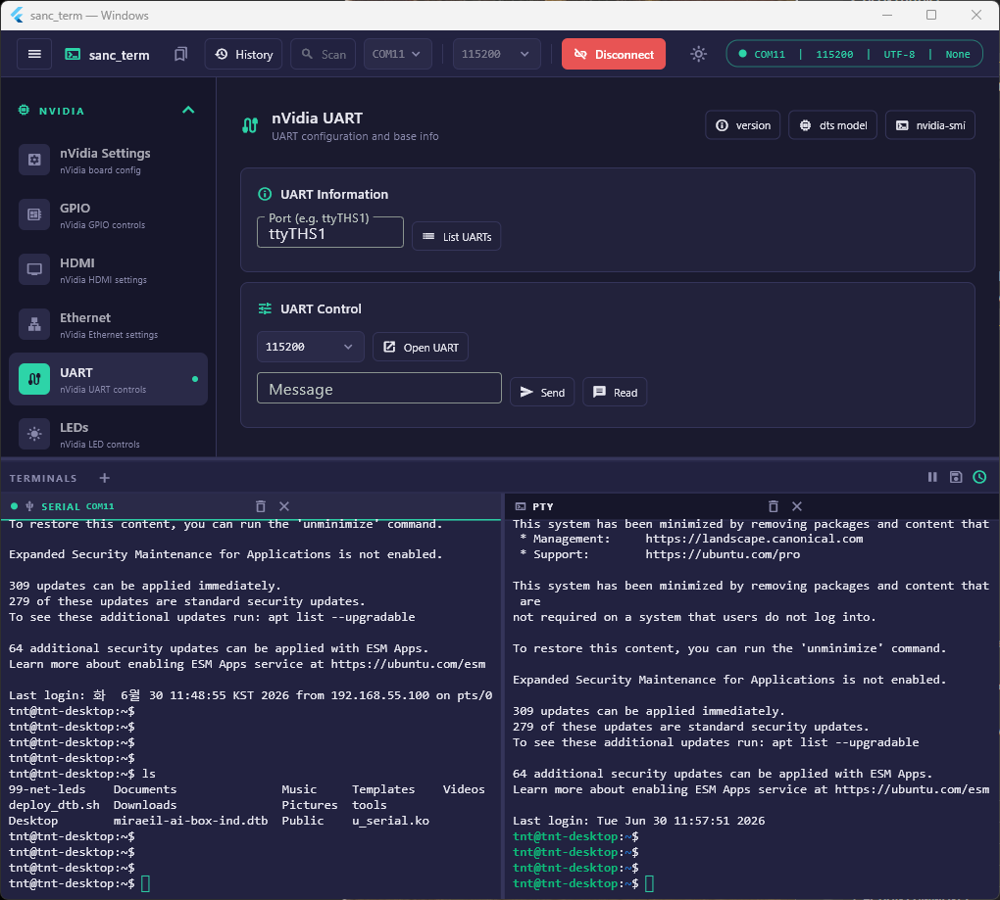
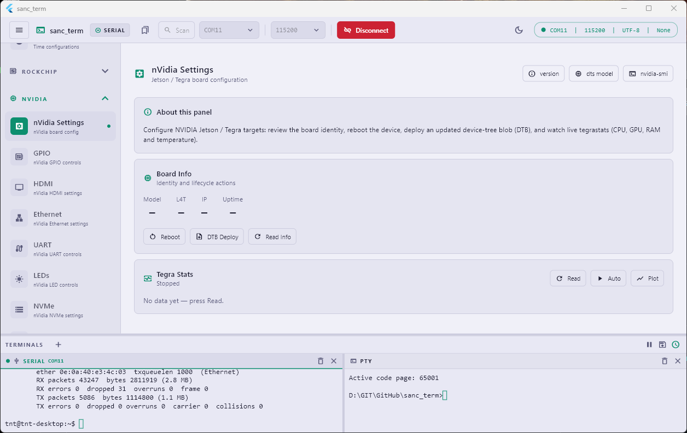

# sanc_term

terminal app which supports xtem/uart/udp support

## Layout tree

```text
Scaffold ─ Column
├─ ConnectionBar                         ← top bar, full width
└─ MultiSplitView (vertical, draggable divider)
   ├─ area "main"  (flex 3)  ── Row
   │   ├─ MenuSidebar                     ← LEFT column (fixed 220px)
   │   └─ Expanded( widget.child )        ← MIDDLE-RIGHT (routed content)
   └─ area "log"   (flex 1)               ← BOTTOM window (terminal panes)
```

### Component Mapping

| Screen Block                    | File                                                  | Notes                                    |
| :------------------------------ | :---------------------------------------------------- | :--------------------------------------- |
| **Top bar** (serial options)    | `lib/features/connection/widgets/connection_bar.dart` | Full-width, above everything             |
| **Left column** (menu)          | `lib/features/home/widgets/menu_sidebar.dart`         | 220px fixed; collapsible groups          |
| **Middle-right** (main content) | routed — `widget.child`                               | Dynamic content (see routing flow below) |
| **Bottom window** (terminals)   | `lib/features/terminal/widgets/log_panel.dart`        | Split terminal panes                     |
| **The whole frame**             | `lib/features/home/home_screen.dart`                  | Owns Column + vertical split             |

### Routing Flow

That widget.child is filled by go_router, so its content changes with what you click in the left sidebar:

  1. lib/core/router/app_router.dart — the ShellRoute wraps everything in HomeScreen and decides what child is:
     - /home → a centered "Select a panel" placeholder
     - /home/panel/:panelId → looks the id up in the panel registry
  2. lib/features/panels/panel_registry.dart — maps each panel id to the actual widget shown in the middle-right. This is where you add/find the screens themselves.
  3. lib/features/panels/models/panel_entry.dart + the panelGroups list — defines the sidebar menu items (label, icon, description) that link to those panels.

So the flow is:
  sidebar item (menu_sidebar.dart) → context.go(`/home/panel/<id>`) → router (app_router.dart) → panel_registry.dart → widget rendered in the middle-right.

## Screens

  

## Features

- 🚀 Cross platform: mobile, desktop, browser
- 📚 Terminal support: xterm, uart, udp support
- 🗄️ Log support: save terminal log to file
  - in Windows, save to Desktop by default
  - other OS, save to DOC directory
- 🔥 popular packages
  - riverpod for state management, go_router for routing
  - hive/window manager support
  - hive for data storage, window manager for window
  - xterm for terminal support
    - xterm package is inside of local due to bug patch
- 🪟 multiple window support
  - serial, pty support
  - short key support, move between windows via `ALT + 1/2/3/4...`
  - log file is logging all of open windows (only one log file available)
- 🌗 dark/light theme support

## History

- 2026.06.25
  - Preparing based on flutter_terminal app for more better architect and performance
  - implemented basic features at `sanc_term_design.md`
  - multiple uart/pty window open support
  - log file dir is desktop by default
- 2026.06.26
  - short key added at terminal to move between windows (`ALT + 1/2/3...`)
  - modify settings menu to handle more menu options
    - add about pop up window
  - added most of panels with default menu items but not tested&verified
  - test&verified 'Tegra Stats' menu and plot
- 2026.06.29
  - uart message send to unselected port issue fixed
    - uart message send to selected uart window
- 2026.06.30
  - History button added at connection_bar for efficient history navigation
  - save current panel and restore previously activated panel at start up
  - added my_utils.dart which includes logger/snackbar and other utilities
  - add ssh button
- 2026.07.01
  - scan com port list took long time and fixed it
- 2026.07.02
  - miner code fixed
  - add localhost switch which sends parsed data to <http://localhost:18765>
    - sanc_graph gets streamed data and display plot
- 2026.07.06
  - add nVidia Ethernet performance test menu
  - add nvidia USB panel
- 2026.07.08
  - add bluetooth panel
  - add udp panel
- 2026.07.10
  - add NORDIC panel
    - thingy53
    - source id button to en/dis at log prints
- 2026.07.13
  - add GPIO control panel at NORDIC nRF/Thingy:53
  - add RGB LED control panel with color palette and brightness slider
at NORDIC nRF/Thingy:53
- 2026.07.14
  - add Buzzer scale buttons
- 2026.07.15
  - add a Text/Hex selector dropdown next to the BLE NUS command field
  - add a hex string parser to convert user input arrays (e.g., `00 11 22` or
     `0xAA 0xBB`) to a `Uint8List` byte array, sending them raw via `sendBleWrite` instead of encoding as UTF-8 string commands
- 2026.07.16
  - add thingy53_parser which parses byte array for message and string for telemetry data
  - add myUtils
  - add nVidia Tesgra memory(RAM/Storage) info to telemetry data
- 2026.07.21
  - add nRF NCS OTA function under NORDIC_nRF panel
    - nRF BLE OTA
    - tested with dfu_application.zip and also zephyr.signed.bin and both are work with OTA
  - add Telemetry data post from BLE payload data
- 2026.07.22
  - updated sensor packet structure
- 2026.07.23
  - while resize terminal panels, somethimes there happenned app pause issue and fixed
  - version info added at title bar
- 2026.07.27
  - add STM32F746G-DISCO panel
- 2026.07.30
  - add F746 wiFi/BLE panel
  - wifi buttons verified
- 2026.07.31
  - add BLE buttons and not verified yet

## Info

- Flutter/Dart
- Author : <louiey.dev@gmail.com>
- Version : 0.1.0
